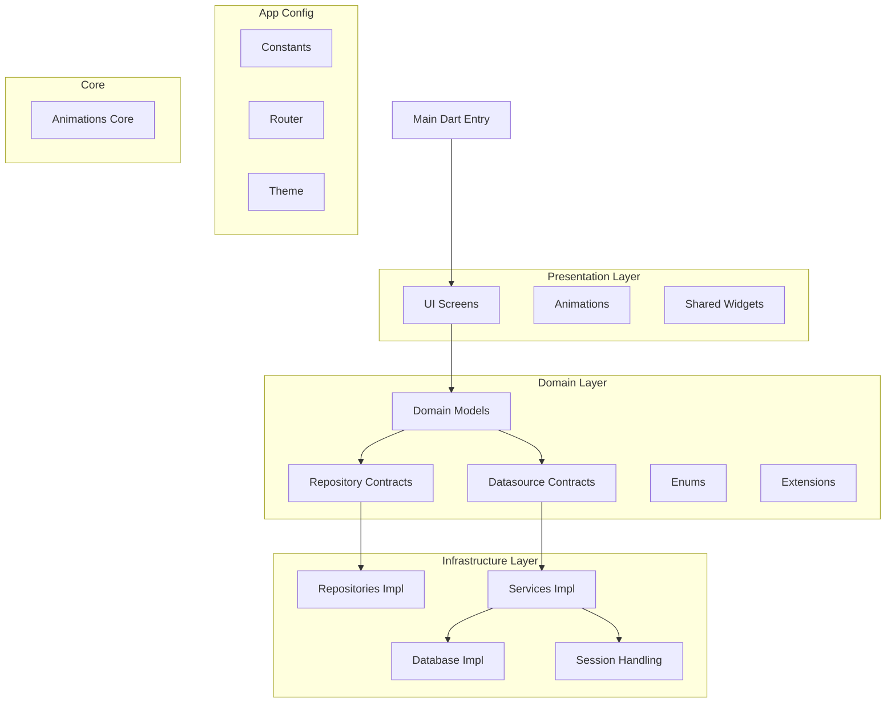

> [!IMPORTANT]
> This project is *cross-platform:* **Web**, **Android**, **iOS**, **Windows**, **Mac**, **Linux**.

# 📦 Project Structure
```dart
lib/
├── config/                 # Configuración global del proyecto
│   ├── constants/          # Constantes globales
│   ├── router/             # Configuración de rutas (GoRouter)
│   │   ├── transitions/    # Animaciones de transición
│   │   ├── app_router.dart # Configuración principal del enrutador
│   │   └── routes.dart     # Definición de rutas
│   └── theme/              # Temas y estilos globales
│
├── core/                   # Capa central (lógica y dominio)
│   ├── animations/         # Animaciones personalizadas
│   ├── domain/             # Entidades y reglas de negocio
│   │   ├── datasources/    # Contratos abstractos de fuentes de datos
│   │   ├── enum/           # Enumeraciones del dominio
│   │   ├── extension/      # Extensiones de Dart/Flutter
│   │   ├── models/         # Modelos de dominio
│   │   └── repositories/   # Interfaces de repositorios (ej: firestore_repository.dart)
│   ├── infrastructure/     # Implementaciones técnicas
│   │   ├── db/             # Implementaciones de base de datos / persistencia
│   │   ├── repositories/   # Repositorios concretos
│   │   ├── services/       # Servicios externos (APIs, etc.)
│   │   └── session/        # Manejo de sesión
│   └── ui/                 # Componentes UI reutilizables
│
├── l10n/                   # Internacionalización (archivos ARB)
│
├── share/                  # Recursos compartidos en todo el proyecto
│   ├── helpers/            # Funciones utilitarias
│   ├── providers/          # Providers globales (ej: Riverpod)
│   └── widgets/            # Widgets reutilizables
│
├── firebase_options.dart   # Configuración de Firebase
├── main.dart               # Punto de entrada principal
```

---

# 🏗️ Architecture



---

# 🚀 Environment Setup
---------------------------

### ✅ System Requirements

> [!CAUTION]
> Make sure to have the correct version of Flutter installed before running.

* ***Flutter 3.29.1*** or *higher* (*``currently using Flutter 3.29.1``*)
* ***Dart 3.7.0*** or *higher* (*``currently using Dart 3.7.0``*)
* ***VS Code*** *or* ***Android Studio*** with *Flutter* and *Dart* extensions

---

# 📦 Requirements

- [Flutter SDK](https://flutter.dev/docs/get-started/install)
- [Dart SDK](https://dart.dev/get-dart) (comes with Flutter SDK)
- [Android Studio](https://developer.android.com/studio) (for Android app development)
- [Xcode](https://developer.apple.com/xcode/) (for iOS app development)

---

# 📚 Useful links
-----------------

> [!TIP]
> These links could be helpful for a better understanding of how the project is working and organized.

* [Clean Architecture](https://celepbeyza.medium.com/introduction-to-clean-architecture-acf25ffe0310)
* [Flutter Documentation](https://flutter.dev/docs)
* [Dart Documentation](https://dart.dev/docs)
* [Riverpod](https://riverpod.dev)
* [Retrofit](https://pub.dev/documentation/retrofit/latest/)
* [Build Runner](https://github.com/dart-lang/build/tree/master/docs)
* [Go Router](https://pub.dev/documentation/go_router/latest/)
* [Freezed](https://pub.dev/documentation/freezed/latest/)
* [Launcher icon](https://pub.dev/documentation/flutter_launcher_icons/latest/)
* [Dot Env](https://pub.dev/documentation/flutter_dotenv/latest/)
* [Google Fonts](https://pub.dev/documentation/google_fonts/latest/)
* [Material Symbols](https://pub.dev/documentation/material_symbols_icons/latest/)
* [Font Awesome](https://docs.fontawesome.com/)

---

# ⚙️ Installation
-----------------

### Getting Started

1. **Clone the Repository**
    ```bash
    git clone <your-repository-url> .
    ```

2. **Install Dependencies**
    ```bash
    flutter pub get
    ```

3. **Build runner**
    ```bash
    flutter pub run build_runner build --delete-conflicting-outputs
    ```

---

# 🛠️ Commands and Scripts
----------------------

### Global Commands

* **`flutter pub get`** → Instala dependencias
* **`dart format .`** → Aplica formateo de código
* **`flutter clean`** → Limpia caché de compilación
* **`flutter pub cache clean`** → Limpia caché de pub
* **`flutter pub cache repair`** → Repara caché de pub
* **`dart run build_runner build`** → Genera código
* **`dart run build_runner build --delete-conflicting-outputs`** → Genera código eliminando conflictos
* **`flutter pub run flutter_launcher_icons`** → Genera íconos de launcher

---

# 📦 Build Commands

### APK Builds
- **`flutter build apk`**

### App Bundle Builds
- **`flutter build appbundle`**

### iOS Builds
- **`flutter build ios`**

### Web Builds
- **`flutter build web`**

> [!NOTE]
> Use the following flags for builds: `--release`, `--profile`, `--debug`

---

# 📌 Version History
-----------------

* ### **v1.1.0** **(2025-08-22)**
    * added: Project structure with detailed documentation
    * added: Architecture diagram

* ### **v1.0.0** **(2025-08-21)**
    * added: Initial project setup
